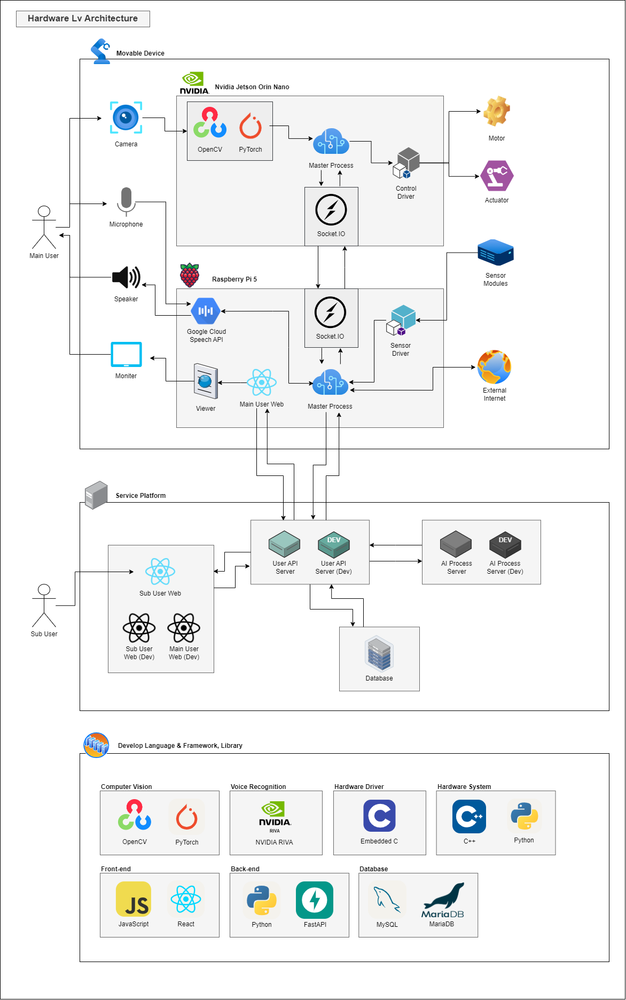
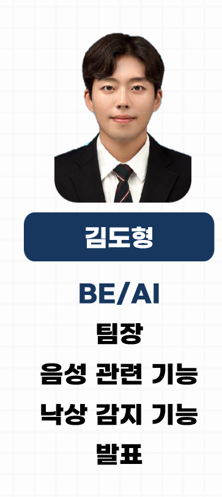
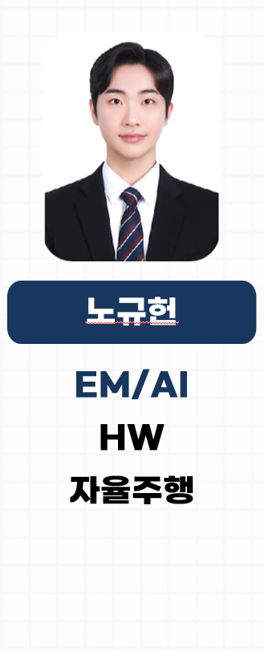
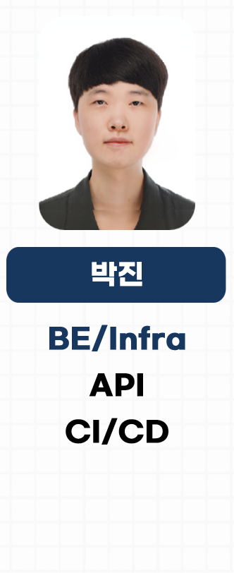
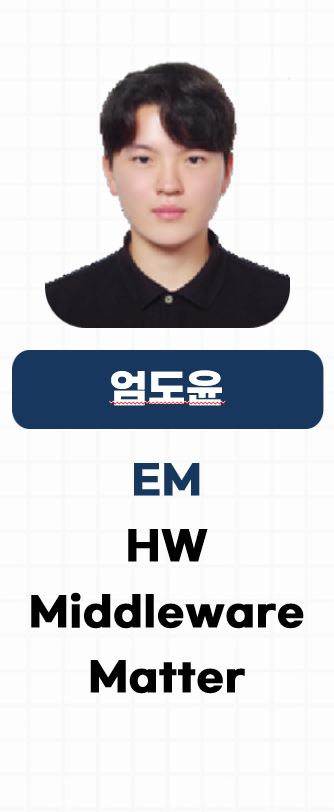
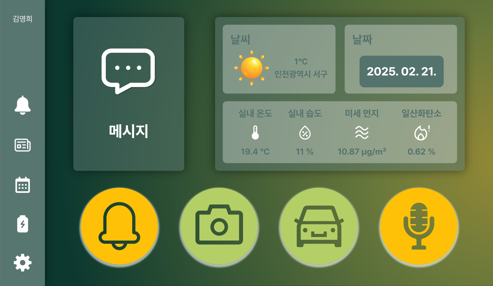
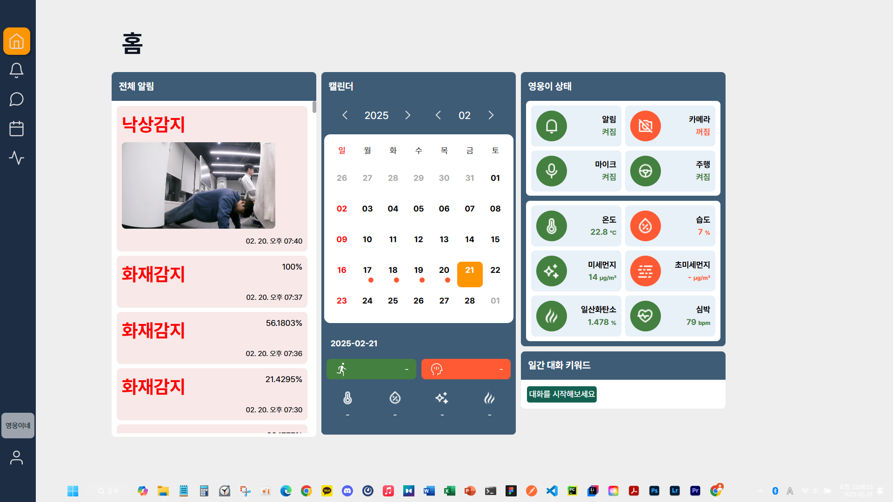
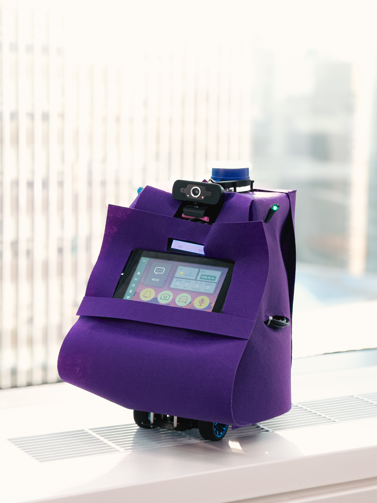

## Carebot Project - AI 실버케어 로봇 플랫폼 "영웅이"

### 개요

Carebot Project는 독거노인을 위한 스마트 생활 도우미 서비스입니다. 이 서비스는 단순한 대화 상대를 넘어, 일상 속에서 동반자가 되어주고, 긴급한 상황에서는 신속한 도움을 제공하는 역할을 합니다.

또한, Carebot은 가족 및 요양보호사가 독거노인의 생활 상태를 원격으로 모니터링할 수 있도록 지원합니다. 대화 내역을 바탕으로 감정 및 심리 상태를 분석하고, 환경 및 활동 데이터를 수집하여 위험 요소를 감지함으로써 보다 안전한 생활을 돕습니다.

### 서비스 설계

### 프로젝트 기여자

### 최종 산출물

> **[독거노인 페이지]**  
> 

> **[보호자 페이지]**  
> 

> **[AI 실버케어 로봇 영웅이]**  
> 

### 프로젝트 일정

| Order | Type | Schedule | Details |
| --- | --- | --- | --- |
| 1 | **`준비`** | `2025.01.06 ~ 01.12` | 프로젝트 주제 선정 및 요구 사항 정리 |
| 2 | **`준비`** | `2025.01.13 ~ 01.19` | 최소 기능 제품(MVP) 개발 및 검증 |
| 3 | **`개발`** | `2025.01.20 ~ 01.26` | 최우선 순위 기능 개발 |
| 4 | **`개발`** | `2025.01.27 ~ 02.02` | 차선 순위 기능 개발 |
| 5 | **`기능 개선`** | `2025.02.03 ~ 02.09` | 1차 QA 및 기능 개선 |
| 6 | **`기능 개선`** | `2025.02.10 ~ 02.16` | 2차 QA 및 기능 개선 |
| 7 | **`마감`** | `2025.02.17 ~ 02.21` | 최종 마감 및 문서화 |